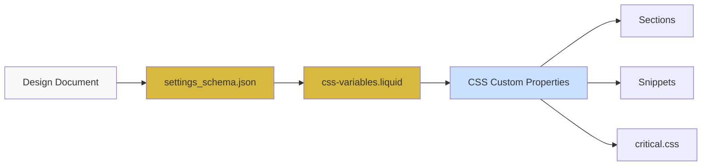
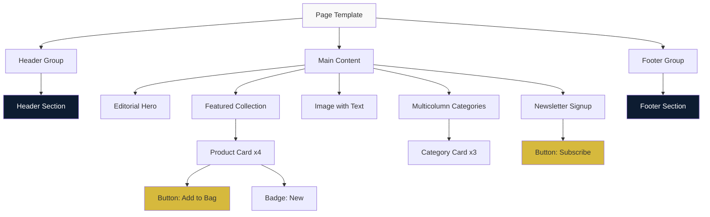
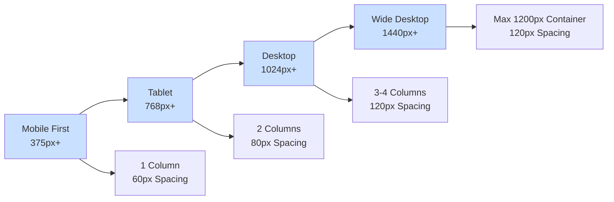
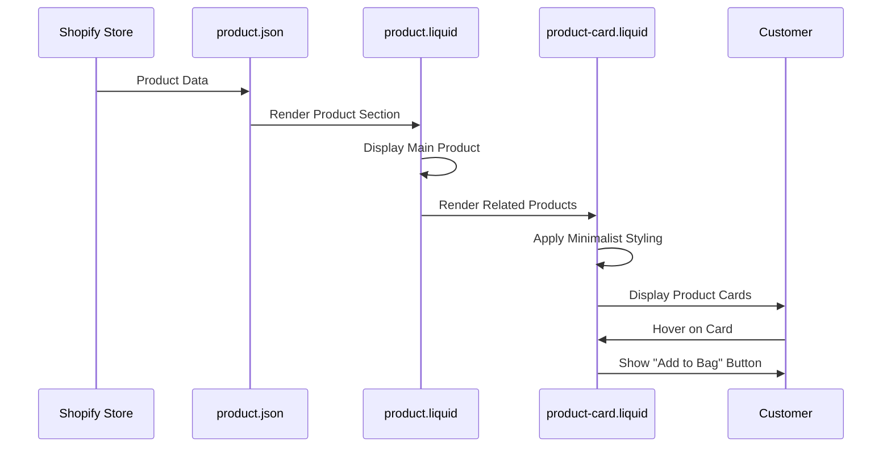
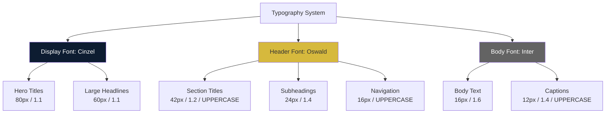
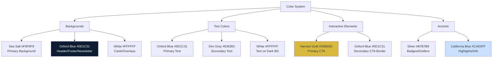
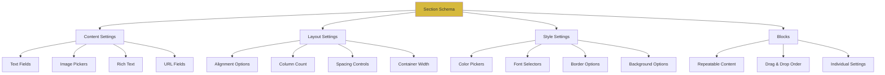
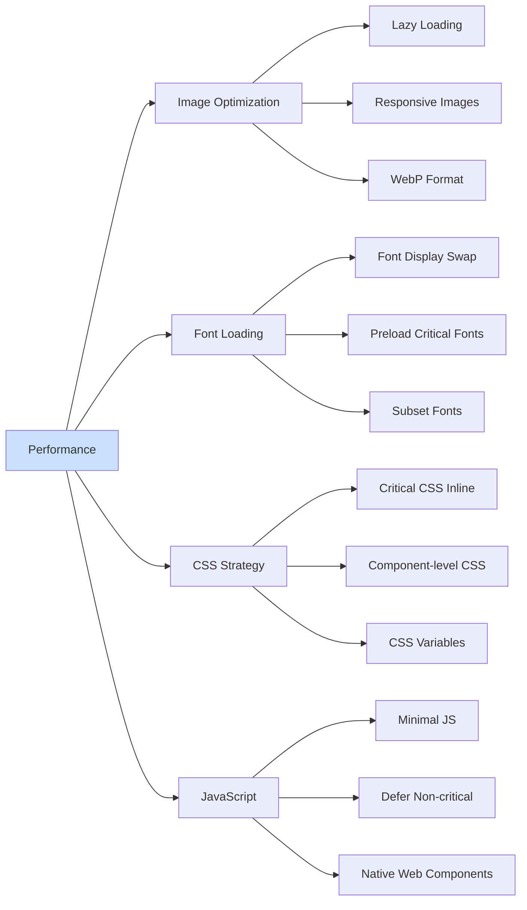

# SON OF ADAM - Theme Architecture

## System Architecture Diagram

```mermaid
graph TD
    A[Theme Root] --> B[Configuration Layer]
    A --> C[Layout Layer]
    A --> D[Section Layer]
    A --> E[Component Layer]
    A --> F[Template Layer]
    
    B --> B1[settings_schema.json<br/>Brand Colors, Fonts, Spacing]
    B --> B2[settings_data.json<br/>Store-specific Settings]
    
    C --> C1[theme.liquid<br/>Main Layout Wrapper]
    C --> C2[CSS Variables<br/>Design System Tokens]
    C --> C3[critical.css<br/>Base Styles & Typography]
    
    D --> D1[Header Section<br/>Premium Navigation]
    D --> D2[Footer Section<br/>Oxford Blue Footer]
    D --> D3[Editorial Hero<br/>Full-width Hero]
    D --> D4[Featured Collection<br/>Product Grid]
    D --> D5[Image with Text<br/>50/50 Split]
    D --> D6[Multicolumn Categories<br/>Category Grid]
    D --> D7[Newsletter Signup<br/>Email Capture]
    D --> D8[Product Section<br/>PDP Layout]
    
    E --> E1[Button Snippet<br/>Primary & Secondary CTAs]
    E --> E2[Product Card Snippet<br/>Minimalist Cards]
    E --> E3[Badge Snippet<br/>New/Limited Labels]
    E --> E4[Accordion Snippet<br/>Expandable Content]
    
    F --> F1[index.json<br/>Homepage Template]
    F --> F2[product.json<br/>Product Page Template]
    F --> F3[collection.json<br/>Collection Template]
    
    D3 -.uses.-> E1
    D4 -.uses.-> E2
    D7 -.uses.-> E1
    D8 -.uses.-> E1
    D8 -.uses.-> E2
    D8 -.uses.-> E3
    D8 -.uses.-> E4
    
    F1 -.includes.-> D1
    F1 -.includes.-> D3
    F1 -.includes.-> D4
    F1 -.includes.-> D5
    F1 -.includes.-> D6
    F1 -.includes.-> D7
    F1 -.includes.-> D2
    
    F2 -.includes.-> D1
    F2 -.includes.-> D8
    F2 -.includes.-> D2
    
    style B1 fill:#D6B93D
    style C2 fill:#D6B93D
    style E1 fill:#CAE0FF
    style E2 fill:#CAE0FF
    style D3 fill:#0D1C31,color:#fff
    style D7 fill:#0D1C31,color:#fff
```



## Design System Token Flow



## Component Hierarchy



## Responsive Layout Strategy



## Data Flow: Product Display



## Typography Hierarchy



## Color Application Map



## Section Schema Pattern



## Performance Optimization Strategy



---

## Key Architectural Decisions

### 1. **Mobile-First Responsive Design**
All sections built with mobile as the baseline, progressively enhancing for larger screens.

### 2. **Component-Based Architecture**
Reusable snippets (buttons, product cards, badges) used across multiple sections for consistency and maintainability.

### 3. **Schema-Driven Customization**
Every section includes comprehensive schema settings, allowing merchants to customize without code.

### 4. **CSS Variables for Design Tokens**
All design system values (colors, spacing, typography) defined as CSS custom properties for easy theming.

### 5. **Performance-First Approach**
Critical CSS inlined, lazy loading for images, optimized font loading strategy.

### 6. **Accessibility by Default**
Semantic HTML, proper ARIA labels, keyboard navigation, color contrast compliance.

### 7. **Modular Section System**
Each section is self-contained with its own styles and logic, making it easy to add, remove, or reorder.

---

## File Dependencies

### Critical Path
1. `settings_schema.json` → Defines available settings
2. `css-variables.liquid` → Converts settings to CSS variables
3. `critical.css` → Base styles using CSS variables
4. Sections → Use CSS variables for styling
5. Templates → Compose sections into pages

### Component Dependencies
- All sections depend on `css-variables.liquid`
- Product sections depend on `product-card.liquid`
- Interactive sections depend on `button.liquid`
- Product details depend on `accordion.liquid`

---

## Development Environment Setup

### Required Tools
- Shopify CLI (latest version)
- Node.js (for any build tools if needed)
- Git for version control
- VS Code with Shopify Liquid extension

### Local Development Workflow
```bash
# Start development server
shopify theme dev

# Push changes to development theme
shopify theme push --development

# Pull latest from store
shopify theme pull --development
```

---

This architecture ensures a scalable, maintainable, and performant Shopify theme that embodies the premium SON OF ADAM brand aesthetic while remaining flexible for future enhancements.